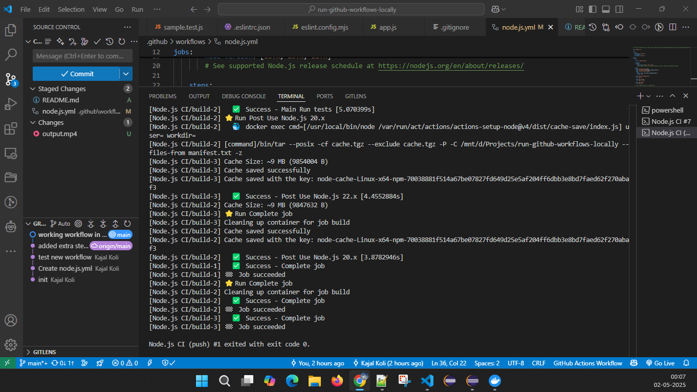

Trying github Local Actions vs code extension.
To run  github workflows locally to avoid unnecessary commits  in your git history.

#successfully ran github  workflows locally with Github Local Actions vs code extension.  

